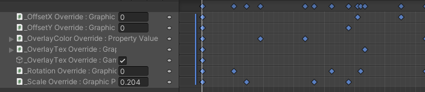
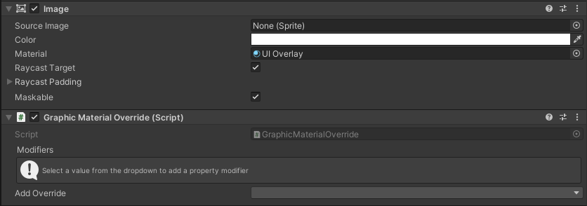
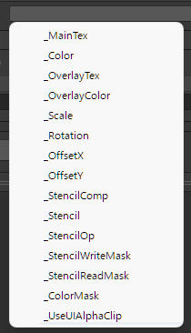
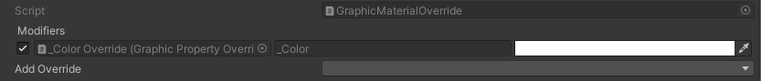
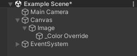
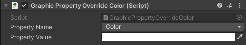
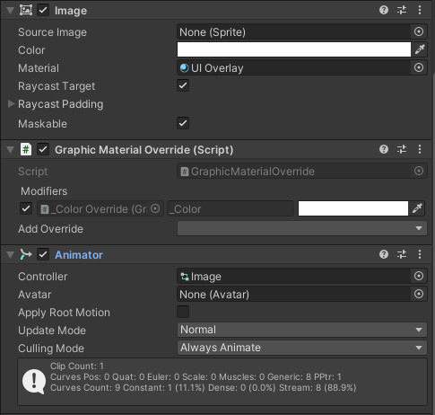
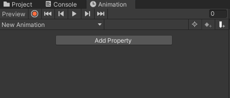
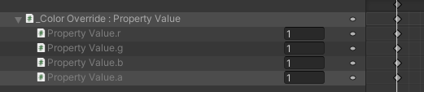
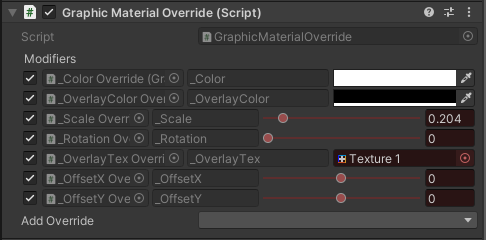

# 

# Introduction

**Animate UI Materials** allows editing and animating materials for a single UI component.

You can see such an example in the demo scene.

# Setup

Download the package from the [asset store](https://assetstore.unity.com/packages/2d/gui/animate-ui-materials-253197) or the Releases folder

Import the package into your project

Simply add the **GraphicMaterialOverride** component to an UI element, such as an **Image** with a custom **Material**

When selecting the dropdown “Add Override”, you will be greeted with every possible property you can animate.

You can ignore those you don’t know, such as the _Stencil properties. They are internal to UI stencil rendering. Simply select “_Color” for example.

Two things will happen:

1. A **new modifier** will be listed in the **GraphicMaterialOverride** component

You can already **edit the color value**, and the change will only affect the Image component

2. A new gameobject will be created, holding a **GraphicPropertyOverride** component

The value displayed here is the exact same as in the **GraphicMaterialComponent**. However this value can also be **animated.**

# Animation

To animate the property, add the usual **Animator** component to the image

Create a new **AnimationClip**

Click **Add Property** and select **_Color Override**, then **Graphic Property Override Color**, then **Graphic Property Override Color.Property Value**

You can now **animate** the value like any other !

Alternatively, hit the **Record** button, and simply modify the properties from the **GraphicMaterialOverride** inspector

# Baking

To get the final modified material as a material asset, simply open the context menu of your GraphicMaterialOverride or Graphic and press "Bake Modified Material". A new material variant will be saved alongside the source material.

# Next Steps

## Emulate an actual MaterialEditor

I want to support custom materials drawers, and other possible combinations, which could be done with a "ghost" MaterialEditor, but would require dropping support before unity 2021.3

https://discussions.unity.com/t/edit-chosen-material-in-the-inspector-for-custom-editor/67530/3

This is required as MaterialEditor does a lot of closed-source heavy lifting to recover that attribute data, and because those attribute drawer require a reference to the MaterialEditor 

# End Notes

If you encounter a bug or need any help, please contact me at [fleeting.being.official@gmail.com](mailto:fleeting.being.official@gmail.com)

Don’t hesitate to look into the code if you want to know how things work !
